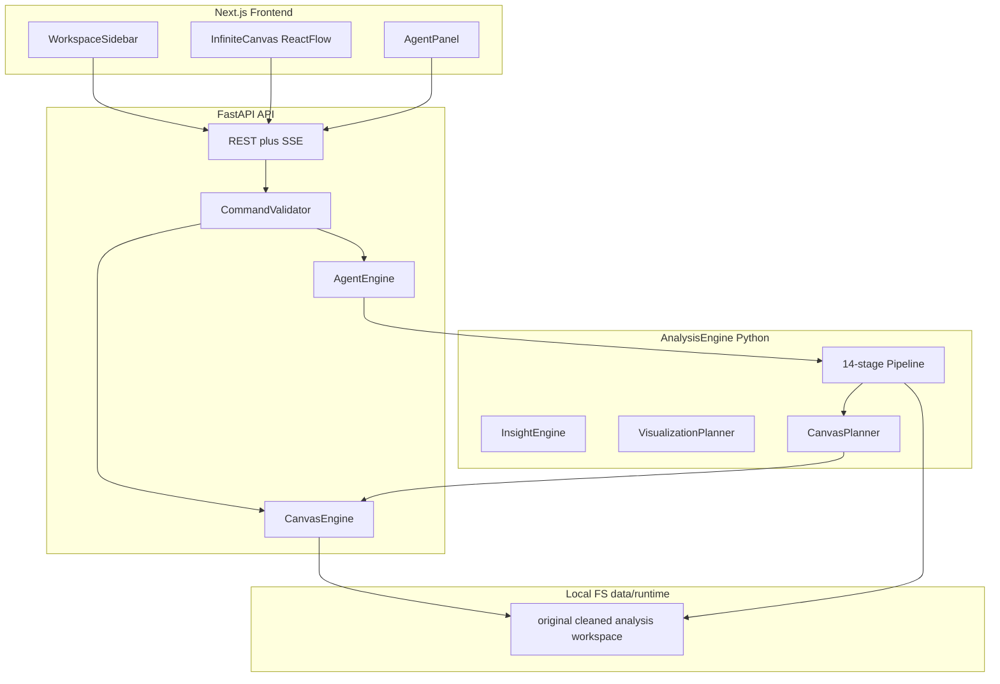
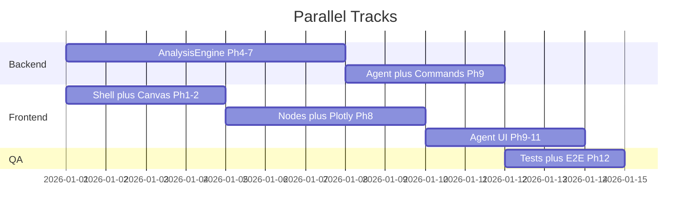

# InsightForge MVP — Greenfield Build Plan

## Context

- **Current state:** Only [`insightforge_mvp_spec.md`](insightforge_mvp_spec.md) exists on branch `chatforce` (no commits). Prior work on git branch `GPT` is **reference-only** per your choice — we will not restore or cherry-pick it.
- **Goal:** Full spec build with testing: upload → auto-analyze → auto-canvas → manual edit → AI agent control, working on unseen datasets without code changes.
- **Recommended default for reliability:** `LLM_PROVIDER=none` until Phase 9; deterministic narrative and tool execution must pass all demos without an external model.

## Architecture

Three independent engines sharing a canonical workspace state:



**Core design rules (from spec Section 61):**
- Workspace state is the single source of truth — not React-only state.
- Every mutation (human or AI) goes through typed commands with validation + undo/redo history.
- LLM never computes numbers; it selects validated tools only.
- Charts, KPIs, and insights are structured JSON specs, not hardcoded UI.

## Repository Layout (create from scratch)

```text
insightforge/
├── apps/
│   ├── web/                    # Next.js 15+, TypeScript, Tailwind, shadcn/ui
│   └── api/                    # FastAPI, agent + canvas services
├── packages/
│   └── analysis-engine/        # Polars pipeline (installable Python package)
├── data/
│   ├── samples/                # demo + test fixtures
│   └── runtime/{workspace_id}/ # persisted at runtime (gitignored)
├── scripts/
│   ├── run_api.py
│   └── test_unseen_dataset.py  # Section 54 acceptance script
├── tests/
│   ├── unit/                   # Python engine tests
│   └── e2e/                    # Playwright upload→analyze→agent flow
├── docker-compose.yml
├── package.json                # npm workspaces root
├── pyproject.toml
├── requirements.txt
└── .env.example
```

## Shared Data Models

Define once in Python ([`packages/analysis-engine/analysis_engine/schemas/models.py`](packages/analysis-engine/analysis_engine/schemas/models.py)) and mirror in TypeScript ([`apps/web/lib/types.ts`](apps/web/lib/types.ts)):

| Model | Key fields |
|-------|-------------|
| `WorkspaceState` | `id`, `title`, `objects[]`, `connections[]`, `comments[]`, `viewport`, `selectedObjectIds` |
| `CanvasObject` | `type` (dataset/chart/kpi/insight/table/filter/summary/text/comment/group), `position`, `size`, `data` |
| `Connection` | `sourceId`, `targetId`, ports, optional routed `route[]` |
| `AnalysisResult` | fingerprint, quality, statistics, correlations, insights, chart_plans, narrative, manifest |
| `AgentCommand` | `command`, validated `payload` (MOVE_OBJECT, CREATE_CHART, etc.) |

Generate OpenAPI from FastAPI and optionally codegen TS types to reduce drift.

## API Surface (spec Section 45)

| Method | Route | Purpose |
|--------|-------|---------|
| POST | `/api/datasets` | Upload CSV/XLSX/Parquet |
| GET | `/api/datasets/{id}/profile` | Fingerprint + column typing |
| POST | `/api/datasets/{id}/analyze` | Start 14-stage pipeline job |
| GET | `/api/jobs/{id}/stream` | SSE progress events |
| GET | `/api/datasets/{id}/analysis` | Full analysis JSON |
| GET/PUT | `/api/workspaces/{id}` | Load/save workspace state |
| POST | `/api/workspaces/{id}/agent` | Agent turn → validated commands |
| GET | `/api/datasets/{id}/export/cleaned` | Download cleaned CSV |

Additional internal routes as needed: `/api/workspaces/{id}/commands` (apply + history), `/api/datasets/{id}/export/analysis`.

**SSE stages:** uploading → profiling → typing → cleaning → statistics → relationships → anomalies → clustering → insights → visualization → narrative → canvas → complete.

## Implementation Phases

### Phase 1 — Shell (Day 1)

**Backend**
- Scaffold FastAPI app with CORS, settings ([`pydantic-settings`](https://docs.pydantic.dev/latest/concepts/pydantic_settings/)), health check.
- [`StorageService`](apps/api/app/services/storage.py): filesystem layout per spec Section 44.
- Wire `npm run dev` to run API (port 8765) + Next.js (port 3000) via `concurrently`.

**Frontend**
- Next.js App Router three-column layout: [`WorkspaceSidebar`](apps/web/components/workspace-sidebar.tsx) | [`InfiniteCanvas`](apps/web/components/canvas/infinite-canvas.tsx) shell | [`AgentPanel`](apps/web/components/agent/agent-panel.tsx).
- Install shadcn/ui, Lucide, TanStack Query, Zustand.
- Landing page with **Upload** + **Try Demo Dataset** (judge mode, Section 51).

**Exit criteria:** App loads; create/list workspaces; empty canvas renders with dot grid.

---

### Phase 2 — Workspace Engine (Days 2–3)

**Canvas engine (server + client)**
- React Flow (`@xyflow/react`) for pan/zoom, nodes, edges, minimap.
- Node components: placeholder shells for all 10 object types.
- [`CommandLayer`](apps/api/app/services/command_service.py): validate + apply `MOVE_OBJECT`, `CREATE_*`, `DELETE_OBJECT`, `CONNECT`, `RESIZE_OBJECT`, `CONFIGURE_CHART`.
- Undo/redo stack (Section 40) — store command history in workspace JSON.
- Right-click [`ContextMenu`](apps/web/components/canvas/context-menu.tsx) per spec Sections 7–8.
- Persist via `PUT /api/workspaces/{id}` on debounced save.

**Exit criteria:** Manually create/move/connect objects; refresh restores state; undo/redo works.

---

### Phase 3 — Dataset Upload (Day 4)

- Upload endpoint with file type validation, size limits, filename sanitization (Section 56).
- Dataset node: empty state → file picker → profile summary card (Section 6).
- Preview table (first N rows) via Polars lazy scan.
- Keep original file untouched in `data/runtime/{id}/original/`.

**Exit criteria:** Upload CSV/XLSX/Parquet; dataset node shows row/column/type counts.

---

### Phase 4 — Profiling (Days 5–6)

Build [`packages/analysis-engine`](packages/analysis-engine/) modules:

| Module | Responsibility |
|--------|----------------|
| `ingestion/loaders.py` | CSV, XLSX, Parquet via Polars |
| `typing/type_inference.py` | 9 semantic types + confidence (Section 10) |
| `typing/roles.py` | measure/dimension/time_dimension/etc. (Section 11) |
| `profiling/fingerprint.py` | Dataset fingerprint JSON (Section 9) |
| `profiling/quality.py` | 0–100 score + breakdown (Section 13) |

Expose `GET /profile` after upload (lightweight) and full profile after analyze.

**Tests:** `tests/unit/test_type_inference.py` — sales, messy, adversarial fixtures.

---

### Phase 5 — Cleaning (Day 7)

- [`cleaning/pipeline.py`](packages/analysis-engine/analysis_engine/cleaning/pipeline.py): conservative transforms with action log (Section 12).
- Write cleaned copy to `cleaned/`; never mutate original.
- Flag outliers; do not auto-delete.
- Surface quality warnings on dataset node + quality panel.

**Tests:** missing detection, duplicate detection, numeric/date parsing, null markers.

---

### Phase 6 — Analytics (Days 8–9)

| Module | Stats |
|--------|-------|
| `statistics/descriptive.py` | numeric/categorical/date summaries (Section 15) |
| `statistics/correlations.py` | Pearson/Spearman, exclude IDs/constants (Section 16) |
| `statistics/categorical.py` | Top-N comparisons (Section 17) |
| `statistics/time.py` | granularity, trend, PoP change (Section 18) |
| `ml/outliers.py` | IQR + modified z-score (Section 19) |
| `ml/clustering.py` | K-Means k=2..6, silhouette guard (Section 20) |

Each stage independently callable; optional stages return `SKIPPED` not errors (Section 55).

**Tests:** correlation on synthetic data, clustering guard (too few rows/columns), time skip when no date.

---

### Phase 7 — Insights (Day 10)

- [`insights/generators.py`](packages/analysis-engine/analysis_engine/insights/generators.py): evidence-backed insight objects (Section 21).
- Rank by importance; dedupe; target 3–5 major insights.
- [`EvidenceDrawer`](apps/web/components/evidence-drawer.tsx) UI tracing DATASET → COLUMN → STATISTIC → INSIGHT (Section 22).
- Deterministic narrative in [`narrative/deterministic.py`](packages/analysis-engine/analysis_engine/narrative/deterministic.py).

**Tests:** insight ranking, evidence attachment, no duplicate titles.

---

### Phase 8 — Auto Canvas (Days 11–13)

**Planners (Python, deterministic)**
- [`visualization/chart_planner.py`](packages/analysis-engine/analysis_engine/visualization/chart_planner.py) — rules from Section 24; reject unreadable charts.
- [`visualization/kpi_planner.py`](packages/analysis-engine/analysis_engine/visualization/kpi_planner.py) — 3–6 KPIs (Section 23).
- [`visualization/canvas_planner.py`](packages/analysis-engine/analysis_engine/visualization/canvas_planner.py) — layout tree from Section 25.
- [`spatial/layout.py`](packages/analysis-engine/analysis_engine/spatial/layout.py) — semantic flow positioning, overlap avoidance.

**Frontend**
- Plotly.js chart nodes driven by chart spec + live data query endpoint.
- **Analyze Automatically** button triggers same pipeline as agent (Section 8).
- KPI, insight, summary node renderers.
- Connection routing: orthogonal paths with obstacle avoidance (Section 39).

**Exit criteria:** One click populates intentional layout with KPIs, charts, insights, summary, connections.

---

### Phase 9 — Agent (Days 14–16)

**Provider adapter** ([`apps/api/app/services/llm_client.py`](apps/api/app/services/llm_client.py)):
```text
none → deterministic intent parser
ollama → local HTTP
openai-compatible → configurable base URL
```

**Tool system** (Section 29): `inspect_canvas`, `inspect_dataset`, `create_chart`, `move_object`, `auto_arrange`, etc. — all return/accept validated JSON commands executed by `CommandLayer`.

**Agent flow:**
1. Gather semantic scene graph (Section 31) + active target (Section 32).
2. LLM (or rule-based fallback) emits tool calls.
3. Server validates → executes → returns action log.
4. Same pipeline for "Analyze this dataset" — no duplicate implementations.

**Dataset chat intents** (Section 43): summary, top category, correlation, trend — safe query layer, no arbitrary Python exec.

**Exit criteria:** Agent creates/moves/configures objects; works with `LLM_PROVIDER=none` via deterministic fallback.

---

### Phase 10 — Cursor, Comments, Point-to-AI (Days 17–18)

- Track cursor, viewport, hovered/selected object (Section 32).
- Comment objects with statuses open/in_progress/resolved/ignored (Section 35).
- **Point to AI** flow (Section 33) + inline AI actions (Section 34).
- **Handle all comments** batch workflow (Section 36) — polished demo feature.

---

### Phase 11 — Spatial Intelligence (Days 19–20)

Deterministic utilities in [`packages/analysis-engine/analysis_engine/spatial/`](packages/analysis-engine/analysis_engine/spatial/):
- `rectangles_overlap`, `find_free_region`, `align_objects`, `distribute_objects`, `count_edge_crossings`, `route_edge`, `snap_to_grid` (Section 37).
- **Auto Arrange** button + agent tool (Section 38).
- **Clean this workspace up** agent workflow (Section 57).

---

### Phase 12 — Demo Polish + Testing (Days 21–23)

**Demo assets**
- Synthetic demo dataset with trend, correlation, outliers, missing, duplicates (Section 52).
- Test fixtures: sales, marketing, employee, health-like, messy, adversarial, random (Section 53).

**Exports:** cleaned CSV, analysis JSON, workspace JSON (Section 59).

**Reproducibility manifest** in every analysis output (Section 58).

**Testing pyramid**

| Layer | Tool | Coverage |
|-------|------|----------|
| Unit | pytest | type inference, cleaning, stats, ML guards, chart planner, insight rank, command validation, spatial utils |
| Integration | pytest + TestClient | upload → analyze → workspace generation |
| Acceptance | `scripts/test_unseen_dataset.py` | Section 54 checklist |
| E2E | Playwright | Section 53 flow: upload → analyze → canvas → agent modify → persist |

**Definition of Done gate:** Manual walkthrough of all 17 steps in spec Section 63.

---

## Suggested Build Order (parallelization)

If working solo, strict sequential phases above. If 2+ devs:



Backend analysis engine (Phases 4–7) can proceed in parallel with canvas shell (Phases 1–2) once API contracts are frozen.

## Improvement Suggestions (beyond spec)

1. **Freeze API contracts in Phase 1** — write OpenAPI + fixture JSON early so frontend/backend decouple.
2. **Command layer in Phase 2, not Phase 9** — undo/redo and agent validation share the same path; deferring this creates rework (GPT branch lesson).
3. **Deterministic-first demo** — ship with `LLM_PROVIDER=none`; add Ollama as stretch. Judges care about evidence, not LLM prose.
4. **React Flow over custom canvas** — spec choice is correct for nodes/edges/handles; avoid Konva-style drawing primitives that don't map to analytical objects.
5. **Chart data endpoint** — separate `GET /api/datasets/{id}/chart-data?spec=...` so chart nodes stay thin; prevents embedding large datasets in workspace JSON.
6. **Adversarial fixture CI gate** — run `test_unseen_dataset.py` on every fixture in GitHub Actions / local pre-demo script.
7. **Workspace-per-conversation model** — left sidebar item = workspace ID; avoids GPT branch's dataset-centric routing (`/dataset/[id]/studio`) which fights the spec's chat-owned canvas model.
8. **Skip HTML report/screenshot export** until DoD passes — spec marks these optional (Section 59).

## Open Questions (non-blocking; defaults assumed)

| Question | Assumed default |
|----------|-----------------|
| LLM for demo? | `none` + Ollama optional via `.env` |
| Deploy target? | Local `npm run dev` + optional `docker-compose` |
| Auth/multi-user? | None (spec non-goals, Section 62) |
| Max upload size? | 100 MB |

## Risk Register

| Risk | Mitigation |
|------|------------|
| Greenfield rebuild of analysis engine is slow | Strict module boundaries; port algorithms from spec pseudocode, not GPT codebase |
| React Flow + Plotly node rendering perf | Lazy-render charts; cap scatter points; aggregate before chart |
| Agent without LLM feels limited | Deterministic intent map for demo script phrases + tool dispatch |
| Full spec in one pass is large | Phase 12 E2E tests lock DoD; cut optional exports/HTML report last |

## Success Criteria

Evaluator can complete spec Section 63 (17 steps) on an **unseen** CSV without code changes, verified by:

```bash
python scripts/test_unseen_dataset.py path/to/unseen.csv
# All stages PASS (ML may SKIPPED)
npm run test:e2e
```

Central demo message (Section 64): *automatic by default, editable by hand, controllable by AI.*
